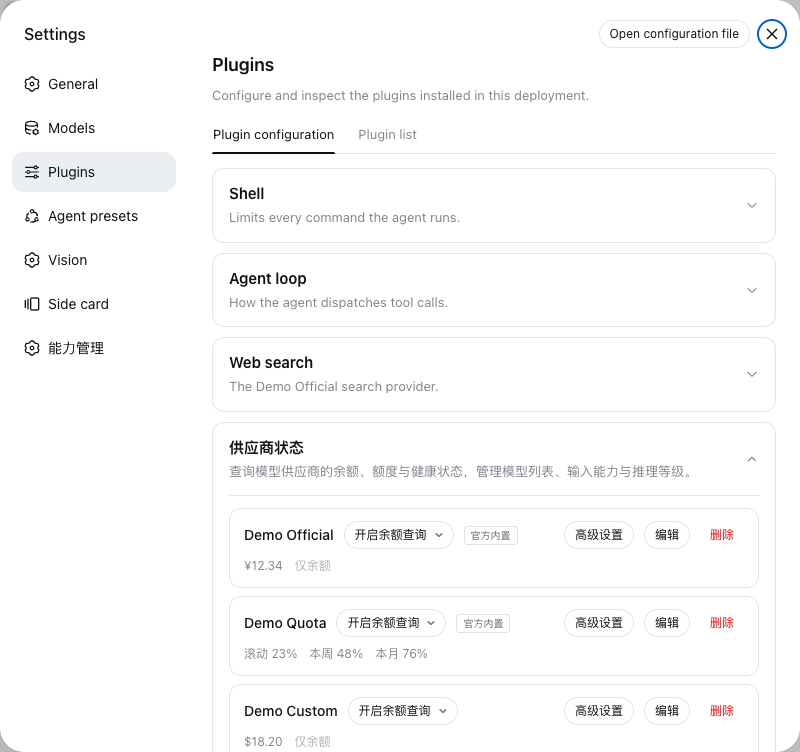
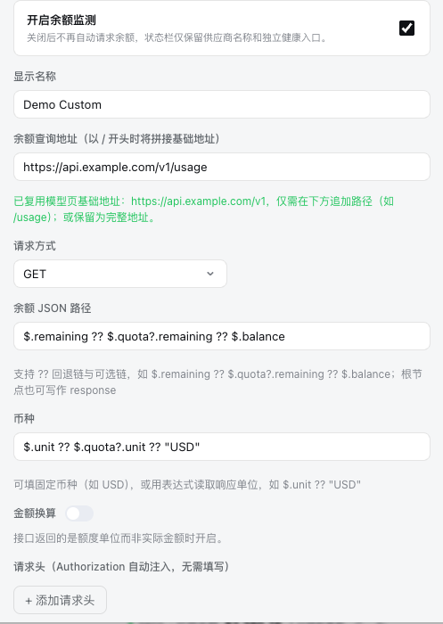
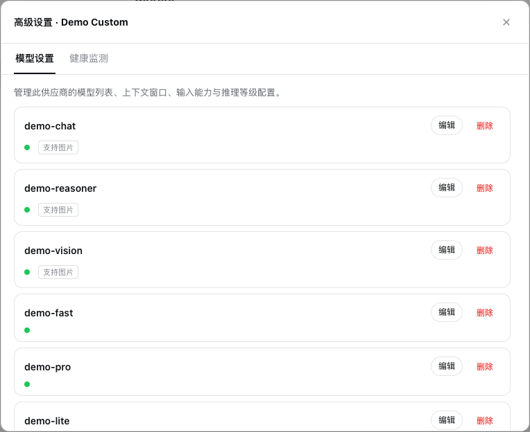
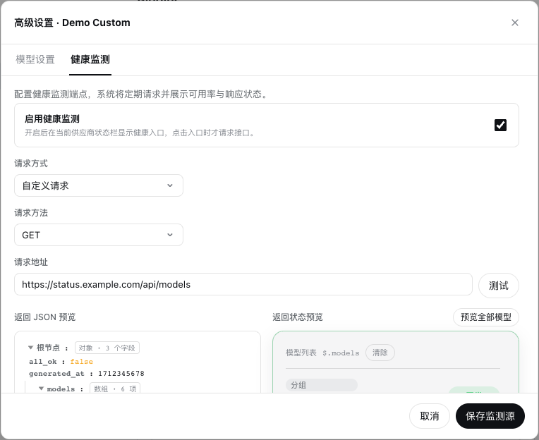
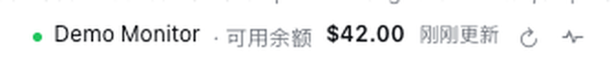
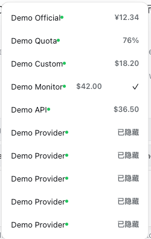
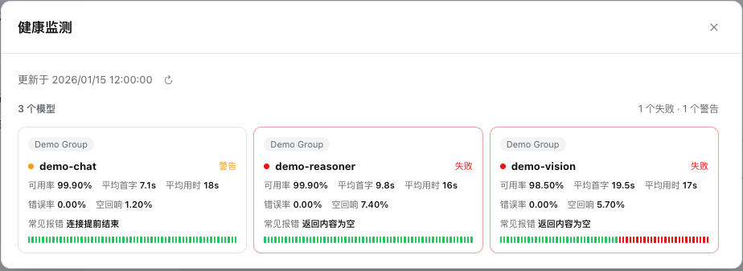

<div align="center">

# dsh-balance-quota

**DeepSeek Harness Web 的余额、额度与模型健康监测插件**

[](https://www.npmjs.com/package/dsh-balance-quota)
[](./LICENSE)
[](https://nodejs.org)
[](https://github.com/kongshan-zhuyu/dsh-balance-quota)

[English](./README.md) · **简体中文**

</div>

`dsh-balance-quota` 在 DSH 对话输入框下方展示模型供应商余额或额度，并可接入第三方 JSON 状态接口，查看模型健康状态、可用率、TTFT、响应耗时、历史记录和自定义指标。

> 当前开发版本：**0.3.3** · 上一个 npm 发布版本：**0.3.2**

## 功能全览

| 模块 | 功能 |
| --- | --- |
| 官方方案 | DeepSeek 余额、OpenCode Go 滚动/周/月额度 |
| 自定义余额 | 公网 HTTPS、GET/无请求体 POST、自定义请求头、超时和刷新间隔 |
| JSON 取值 | 属性路径、数组索引、`?.` 可选链、最多 5 个 `??` 回退分支 |
| 金额处理 | 固定/动态币种、金额除数、余额配置草稿测试 |
| 状态栏 | 输入框下方显示余额、更新时间、强制刷新和健康入口 |
| 供应商选择 | 设置默认供应商、状态栏切换、每个会话独立记忆 |
| 模型设置 | 管理模型列表、上下文窗口、文本/图片输入能力和推理等级 |
| 健康监测 | 外部 JSON 接口、模型状态、可用率、TTFT、响应耗时和历史记录 |
| 可视化绑定 | 点击右侧槽位，再点击左侧 JSON 字段；绑定后实时预览 |
| 全模型预览 | 使用当前映射预览最多 50 个模型，无需重复请求接口 |
| 数据转换 | 原文、数字、百分比、状态；支持状态值映射和百分比倍率 |
| 数字格式 | 每个数字字段独立设置接口单位、显示单位和 0–2 位小数 |
| 自定义字段 | 添加错误率、空回响、常见报错等任意模型指标 |
| 缓存与刷新 | Host 共享余额缓存、健康 JSON 预览缓存、页面后台暂停刷新 |
| 凭据安全 | 复用 DSH credential ref，API Key 不进入浏览器配置 |
| 网络安全 | 公网 HTTPS、DNS 固定、防 DNS 重绑定、私网/重定向拦截 |

## 安装

要求：**Node.js 22+** 和可用的 DSH CLI。

```bash
dsh plugin --profile web add dsh-balance-quota
dsh web
```

安装或升级后需要重启 `dsh web`。检查插件：

```bash
dsh plugin --profile web list
```

# 完整使用教程

下面 7 张截图均来自当前版本的真实插件界面。仅将供应商名、接口地址、余额和模型名替换为演示值，界面布局和控件没有重绘。

## 1. 余额去哪里配置

打开：**Settings → Plugins → Plugin configuration → 供应商状态**。

这个页面可以开启余额查询、查看余额/额度、编辑余额接口、进入高级设置、选择默认供应商、开启状态栏和手动刷新。



- DeepSeek 和 OpenCode Go 可以直接使用官方内置方案；
- 其他供应商点击 **编辑** 配置自定义余额接口；
- **高级设置**包含「模型设置」和「健康监测」两个 Tab；
- 页面底部的「默认供应商」决定新会话初始选择；
- 页面底部的「状态栏」控制聊天输入框下方是否显示余额。

## 2. 编辑余额供应商

在供应商行点击 **编辑**：



可配置：

- 开启/关闭余额监测；
- 显示名称；
- 余额查询地址；
- GET 或无请求体 POST；
- 余额 JSON 路径；
- 固定币种或动态币种表达式；
- 金额换算、自定义请求头、刷新间隔和请求超时。

路径示例：

```text
余额：$.remaining ?? $.quota?.remaining ?? $.balance
币种：$.unit ?? $.quota?.unit ?? "USD"
```

点击 **测试** 只验证当前未保存草稿，不写入正式配置、凭据或正式缓存；确认正确后再点击 **保存**。

## 3. 高级设置第一个 Tab：模型设置

点击供应商行的 **高级设置**，默认进入「模型设置」：



这个 Tab 管理当前供应商在 DSH 中可使用的模型能力：

- 模型 ID 和显示名称；
- 上下文窗口；
- 文本/图片输入能力；
- 默认推理等级和可选推理等级。

它不负责余额和健康接口：余额由「编辑」配置，外部状态由第二个 Tab 配置。

## 4. 高级设置第二个 Tab：健康监测

切换到「健康监测」：



配置流程：

1. 勾选 **启用健康监测**；
2. 选择自定义请求；
3. 填写公网 HTTPS、GET、JSON 接口；
4. 点击 **测试**；
5. 左侧查看完整 JSON 树；
6. 右侧绑定字段并实时预览；
7. 点击 **预览全部模型** 检查所有映射；
8. 点击 **保存监测源**。

健康监测读取第三方监控数据，不调用聊天模型，不消耗模型额度。

### 字段绑定

必须先绑定模型列表：点击右侧「模型列表」槽位，再点击左侧数组节点，例如 `$.models`。

| 字段 | 示例路径 | 作用 |
| --- | --- | --- |
| 模型名称 | `$.model` | 卡片标题 |
| 分组 | `$.group` | 模型分组标签 |
| 状态 | `$.status` | 正常、失败、警告、未知 |
| 可用率 | `$.availability` | 当前可用率 |
| TTFT | `$.ttft_ms` | 首 Token 延迟 |
| 响应耗时 | `$.latency_ms` | 请求响应时间 |
| 历史数组 | `$.history` | 最近状态记录 |
| 历史状态 | `$.state` | 单条记录状态 |
| 历史时间 | `$.time` | 单条记录时间 |
| 历史错误 | `$.message` | 单条记录错误 |

### 转换、状态映射和数字格式

- **原文**：原样显示文本；
- **数字**：转换数值，并设置接口单位、显示单位和精度；
- **百分比**：自动、强制 ×100 或原值加 `%`；
- **状态**：转换为正常、失败、警告或未知。

自定义状态值可以点击 **值映射**：

```text
healthy → 正常
warning → 警告
offline → 失败
```

自定义字段选择 **数字** 后显示三个配置：

| 配置 | 可选值 |
| --- | --- |
| 接口单位 | `接口 ms`、`接口 s` |
| 显示单位 | `显示跟随`、`显示 ms`、`显示 s` |
| 小数位 | `整数`、`1 位`、`2 位` |

例如接口返回 `1250ms`，选择显示 `s`、保留 2 位，结果为 `1.25s`。每个字段独立保存，不影响其他字段。

## 5. 配置后状态栏在哪里

在供应商状态页底部开启 **状态栏**，回到任意对话。状态栏位于**聊天输入框正下方**：



从左到右是：健康圆点、当前供应商、余额/额度、更新时间、强制刷新、健康监测入口。

## 6. 如何切换供应商

点击状态栏中的供应商名称：



- 当前供应商带勾选标记；
- 选择按会话独立记忆；
- 新会话使用设置页指定的默认供应商；
- 点击 `↻` 可以绕过缓存立即刷新当前余额。

## 7. 开启健康监测后怎么查看

当前供应商启用并保存健康监测后，刷新按钮右侧出现**心电图图标**。点击图标才请求接口并打开详情：



详情包含：

- 模型总数、失败数和警告数；
- 模型分组、名称和当前状态；
- 可用率、平均 TTFT 和平均响应时间；
- 错误率、空回响、常见报错等自定义字段；
- 最近状态历史条；
- 手动刷新按钮。

健康状态代表第三方监控源结果，不等于当前账户状态。

## 刷新与缓存

- 每个余额供应商独立设置刷新间隔，默认 30 分钟；
- 页面处于后台时不自动刷新；
- 页面恢复可见后，仅在达到刷新间隔时查询；
- 多个会话共享 Host 余额缓存；
- 状态栏刷新按钮强制绕过缓存；
- 健康 JSON 预览按监测源缓存；
- 删除监测源时同步删除预览缓存。

## 常见问题

### 状态栏没有出现

确认已经配置至少一个供应商，并在供应商状态页底部开启「状态栏」。安装或升级后需要重启 `dsh web`。

### 看不到健康图标

在 **高级设置 → 健康监测** 中启用监测、测试成功并保存。图标只显示在已启用健康监测的当前供应商状态栏上。

### 保存提示 `invalid external custom field`

先绑定模型列表，再从模型项内部选择字段。名称和路径不能为空；`$.last_errors[0]` 是合法路径。当前版本会清理前后空格并忽略未完成的空字段。

### 查询失败

确认接口为公网 HTTPS、没有重定向，credential ref 有效，JSON 路径与实际响应一致。插件会拒绝私网、回环地址和内部域名。

## 安全边界

- API Key 由 DSH `credentials` 服务管理，不进入浏览器配置；
- 只允许公网 HTTPS；
- DNS 解析后固定公网 IP，降低 DNS 重绑定风险；
- 拒绝私网/回环地址、重定向、危险请求头和超大响应；
- JSON 路径拒绝 `__proto__`、`constructor`、`prototype`；
- 健康监测不执行网页脚本，不自动发现网页内部接口，不支持 Cookie 或鉴权监控接口。

详见 [`SECURITY.md`](./packages/dsh-balance/SECURITY.md)。

## 开发与验证

唯一对外发布包为 `packages/dsh-balance`。

```bash
pnpm install
pnpm dev:install
pnpm check
pnpm test
pnpm pack:check
pnpm verify
```

## 项目结构

```text
packages/dsh-balance/
├── lib/host/       # 安全查询、校验、缓存、配置和健康数据归一化
├── lib/client/     # DSH Web 状态栏和设置界面
├── docs/images/    # README 真实脱敏截图
├── test/           # 单元与安全测试
├── README.md       # npm 包使用文档
└── SECURITY.md     # 安全边界
```

## 许可证

[MIT](./LICENSE)
