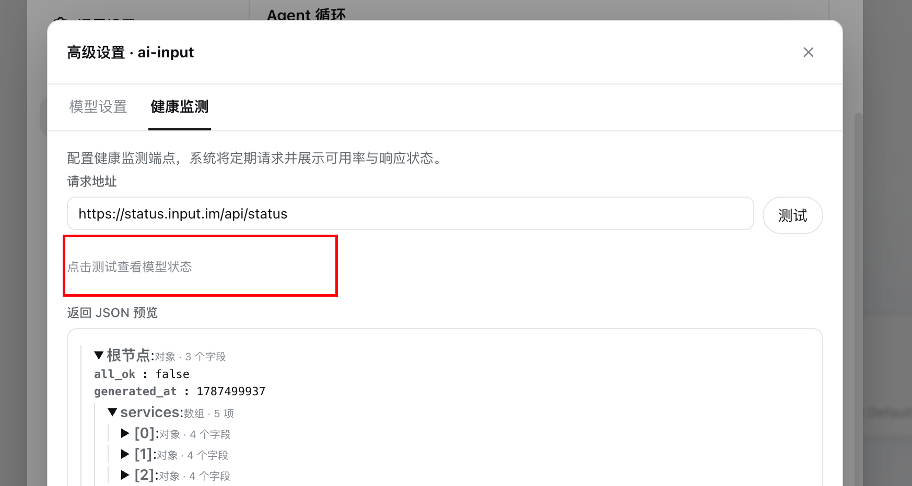
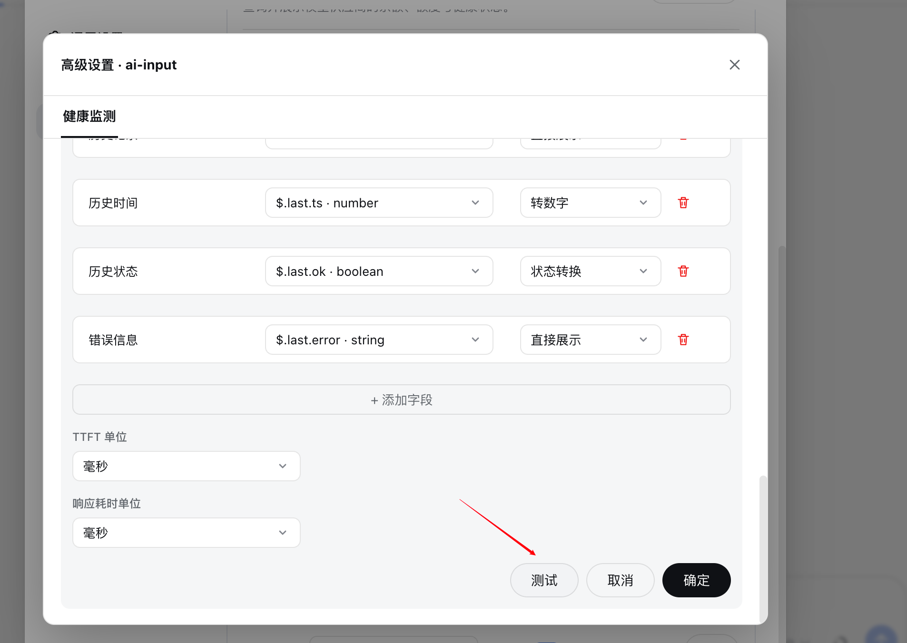

<div align="center">

# dsh-balance-quota

**说话之前，先看余额。** 为 [DeepSeek Harness](https://github.com/deepseek-ai/dsh)（DSH）
Web 界面提供安全可靠的余额与额度状态栏。

[](https://www.npmjs.com/package/dsh-balance-quota)
[](./LICENSE)
[](https://nodejs.org)
[](https://github.com/kongshan-zhuyu/dsh-balance-quota)

[English](./README.md) · **简体中文**

</div>

## 界面预览

### 测试健康监测接口并预览 JSON



### 绑定字段、转换数据并实时预览



> 完整功能表与 5 步使用教程见 [`packages/dsh-balance/README.md`](./packages/dsh-balance/README.md)。

---

`dsh-balance-quota` 把模型供应商的余额、额度与外部健康状态直接带到 DSH Web。
当前开发版本为 **0.3.3**，上一版 npm 发布版本为 **0.3.2**。0.3.3 新增可视化 JSON
字段绑定、自定义字段转换，以及数字字段的接口单位、显示单位与小数位配置。它以单个
可安装包的形式，把 Host 查询、Web 状态栏、设置页与发布 Bundle 收敛为一体。

> **🎯 它的作用** — 在输入框下方展示实时余额/额度条，支持逐会话记忆与一键切换菜单。
> **🧩 兼容性** — DSH Web，Node.js 22+；内置 DeepSeek 与 OpenCode Go 官方方案，
> 也可接入任意公开 HTTPS 余额接口。
> **🔐 安全性** — 仅 HTTPS、防 DNS 重绑定；API Key 只保存在 Host 端 DSH 钥匙串，
> 绝不进入浏览器。

- ✅ **官方内置方案** — DeepSeek 余额与 OpenCode Go 额度开箱即用。
- 🔐 **默认安全** — 仅 HTTPS、防 DNS 重绑定、凭据存入 DSH 钥匙串。
- 🎯 **自定义任意供应商** — 接入任何公开 HTTPS 余额/额度接口，支持 JSON 路径提取。
- 🧠 **逐会话记忆** — 每个对话记住你为它选择的供应商。

---

## 🖥️ 界面一览

插件会在每个对话的**消息输入框正下方**绘制一条紧凑的状态栏：

```text
  ● DeepSeek  · 可用余额  ¥12.34    3 分钟前更新  [↻]
   └─ 绿点 = 连接正常        加粗 = 数值        ↻ = 强制刷新
```

- **状态栏** — 一条低调的小条：健康/异常圆点、供应商名称、随后是余额
  （`· 可用余额 ¥12.34`）或额度窗口（OpenCode Go 显示 `· 滚动 12% · 每周 45%`）、
  最近更新时间提示、以及 ↻ 刷新按钮。
- **供应商菜单** — 点击状态栏上的供应商名称，弹出一个小下拉菜单，列出所有已配置
  供应商及其当前数值，当前选中的供应商带 ✓ 标记。
- **设置页** — **设置 → 插件 → 供应商状态** 卡片列出各供应商：实时状态圆点、每项
  的余额或额度百分比、「编辑 / 删除」操作、模型路由绑定选择器，以及状态栏总开关与
  刷新按钮。

---

## ✨ 功能特性

- **余额与额度一览** — 在输入框直接展示 DeepSeek 可用余额，或 OpenCode Go 的滚动 /
  每周 / 每月用量。
- **一键切换供应商** — 点击状态栏上的供应商名称，弹出菜单即可即时切换。
- **逐会话记忆** — 你为某个会话选择的供应商只对该会话生效，回到该会话时自动恢复；
  未手动选择过的会话显示第一个已配置的供应商。
- **官方内置方案** — DeepSeek `/user/balance` 与 OpenCode Go 用量接口，均已验证。
- **自定义供应商** — 任意公网 HTTPS 余额/额度接口，支持 `GET` 或无请求体 `POST`、
  自定义请求头、超时、缓存间隔、币种与金额换算。
- **强大的 JSON 路径提取** — 可选链 `?.` 与最多 5 个 `??` 回退分支，
  例如 `$.remaining ?? $.quota?.remaining ?? $.balance`。
- **复用你的模型配置** — 优先使用 DSH「模型」页已有的基础地址与 credential ref。
- **高效省电** — 每个供应商独立设置刷新间隔（默认 30 分钟）、后台不轮询、
  Host 按供应商共享缓存、并提供手动强制刷新按钮。

## 📦 安装

需要 **Node.js 22+** 与 DSH CLI。

安装最新版本：

```bash
dsh plugin --profile web add dsh-balance-quota
```

安装或升级后重启 Web Profile：

```bash
dsh web
```

确认已安装：

```bash
dsh plugin --profile web list
```

> [!NOTE]
> 卸载请使用当前 `dsh plugin --help` 显示的 profile 插件 remove 命令；不同 DSH 版本的
> 删除参数可能不同，因此本仓库不在脚本中硬编码未经验证的变体。

### 本地开发

```bash
pnpm install
pnpm dev:install   # 只安装 packages/dsh-balance，并根据操作系统自动选择正确的 DSH CLI
```

## ⚙️ 配置

打开 **设置 → 插件 → 供应商状态**。

1. 对 **DeepSeek** 或 **OpenCode Go**，点击对应模型供应商上的 **使用官方方案**。
2. 插件会复用「模型」页已有的 credential ref——绝不会覆盖或删除该共享凭据。
3. 对其他供应商，选择 **接入余额查询**，填写公开 HTTPS 余额/额度接口与 JSON 路径。

可在设置区底部选择默认供应商、启用/停用状态栏，并把供应商绑定到模型路由以便整理展示。编辑供应商时点击「测试」可验证未保存的表单草稿；测试不会保存配置、凭据或正式缓存。

### 自定义供应商示例

```text
余额路径：  $.remaining ?? $.quota?.remaining ?? $.balance
币种：      $.unit ?? "USD"
```

支持：仅公网 HTTPS 接口、`GET` 或无请求体 `POST`、带 `?.` 与最多 5 个 `??` 回退分支的
JSON 属性路径、固定 ISO 4217 币种或从响应读取、自定义请求头、超时、缓存间隔与金额换算。

### 配置项

| 选项 | 默认值 | 说明 |
| --- | --- | --- |
| `statusBar` | `true` | 是否在输入框显示余额状态栏。 |
| `queryIntervalMinutes` | `30` | 每个供应商的刷新间隔（0 表示关闭自动刷新）。 |
| `timeoutSeconds` | `10` | 自定义供应商的请求超时。 |
| `method` | `GET` | `GET` 或无请求体 `POST`。 |
| `responsePath` | — | 余额值的 JSON 路径，支持 `?.` / `??`。 |
| `currency` | `"USD"` | 固定 ISO 4217 币种，或 `$.unit ?? "USD"` 这类表达式。 |
| `valueDivisor` | `1` | 接口原始值 ÷ 除数 = 显示金额（用于额度单位的场景）。 |
| `headers` | `{}` | 额外请求头（`Authorization` 会自动注入）。 |

## 📡 外部模型状态

供应商右侧的「高级设置」支持按监测源 Tab 接入任意**公网 HTTPS + GET + JSON** 状态接口。每个监测源独立一个 Tab；填写接口后点击「测试/解析 JSON」，再从左侧 JSON 树绑定模型列表、模型名称、状态、可用率、TTFT、响应耗时、历史记录和自定义字段。数字型自定义字段可独立设置接口单位（ms/s）、显示单位（跟随/ms/s）和 0–2 位小数。

完整的逐步教程、字段表格、换算示例和保存错误排查见 [npm 包使用文档](./packages/dsh-balance/README.md)。

这个功能只读取第三方监控数据，不调用你的模型 API，不保存模型凭据，也不会消耗你的模型额度。状态代表外部监控源，不等于当前账号状态。

例如 Input：

```text
API：      https://status.input.im/api/status
列表路径： $.services
模型路径： $.model
状态路径： $.last.ok
可用率：   $.uptime_pct
历史：     $.history
```

例如 Neco：

```text
API：      https://speed.sbbbbbbbbb.xyz/api/pulse?window=604800
列表路径： $.models
模型路径： $.model
状态路径： $.health
可用率：   $.success_rate
TTFT：     $.avg_ttft_ms
响应耗时： $.avg_resp_sec（单位选择“秒”）
```

仅支持 JSON 字段映射；不执行网页脚本、不自动分析网页内部接口，不支持 POST、Cookie 或鉴权。API 地址仍会执行公网 HTTPS、DNS、重定向、响应大小和安全路径校验。

## 🧠 供应商选择

状态栏始终显示**你手动选择**的供应商。菜单按**会话**记忆——切换会话后自动恢复该会话
上次的选择；未手动选择过的会话显示第一个已配置的供应商。设置页的绑定仅用于整理与展示，
状态栏不再根据会话模型自动切换。

## 🔄 刷新与性能

- 每个供应商可单独设置刷新间隔 `queryIntervalMinutes`（默认 **30 分钟**）。
- 页面处于后台时**不会**自动刷新。
- 恢复可见时，仅当当前供应商已到刷新间隔才重新查询。
- Host 按供应商缓存结果，多个会话共用同一供应商时复用同一份数据。
- 状态栏的 ↻ 按钮强制绕过缓存，立即查询。

## 🔐 凭据与安全

凭据统一通过 DSH `credentials` 服务解析与存储，不再区分操作系统。自定义 API Key
不会写入余额 JSON 配置，也不会通过浏览器配置接口返回；模型页共享凭据绝不会被插件
覆盖或删除。

余额接口必须为**公网 HTTPS**。插件会拒绝私网/回环地址、内部域名、重定向、危险请求头
与超大响应，并在每次请求时重新校验 DNS 以降低 DNS 重绑定风险。详见
[SECURITY.md](./SECURITY.md)。

## ❓ 常见问题

**为什么状态栏显示「未配置余额供应商」？**
还没有配置任何供应商，或当前会话没有可用的供应商。请到 **设置 → 插件 → 供应商状态**
配置一个供应商，状态栏会显示第一个已配置的供应商。

**接口明明没错，却一直「查询失败」？**
插件只调用公网 HTTPS 接口，会刻意拒绝私网/回环地址、内部域名与重定向。另外请确认
credential ref 已能解析（见「模型」页），且 JSON 路径与响应结构一致。可用 ↻ 按钮强制
重新查询。

**插件怎么知道我用的哪个账户？** 它复用「模型」页已配置的 credential ref 与基础地址，
跟随 DSH 当前使用的模型账户——而且绝不会覆盖或删除该共享凭据。

**会一直轮询、偷偷扣费吗？** 不会。页面只在可见时、且至少间隔 `queryIntervalMinutes`
（默认 30 分钟）才刷新一次，后台绝不轮询；Host 按供应商缓存，多个会话共用一次查询结果。

**浏览器里放 API Key 安全吗？** Key 不会写入余额 JSON 配置，也不会通过浏览器配置接口
返回——它由 Host 端通过 DSH `credentials` 服务解析。详见 [SECURITY.md](./SECURITY.md)。

## 🗂️ 项目结构

```text
packages/
├─ dsh-balance/          # 对外发布包：Host、Client、Bundle、测试与文档
├─ dsh-host-balance/     # 旧版内部 Host，保留作迁移期回归对照
├─ dsh-client-balance/   # 旧版内部 Client，保留作迁移期回归对照
└─ dsh-bundle-balance/   # 旧版内部 Bundle，保留作迁移期回归对照
```

新的用户安装只使用 `dsh-balance-quota`。其余三个旧包仅作回归对照保留，不再作为独立发布包。

## ✅ 质量检查

```bash
pnpm check
pnpm test
pnpm pack:check
pnpm verify
```

GitHub Actions 会在 Ubuntu、Windows、macOS 及 Node.js 22/24 上运行相同检查。
发布包使用 `files` 白名单，只包含运行时代码与文档。

## 📚 文档

- [统一包说明](./packages/dsh-balance/README.md)
- [安全策略](./SECURITY.md)
- [变更日志](./CHANGELOG.md)

## 📄 许可证

[MIT](./LICENSE) © kongshan-zhuyu
